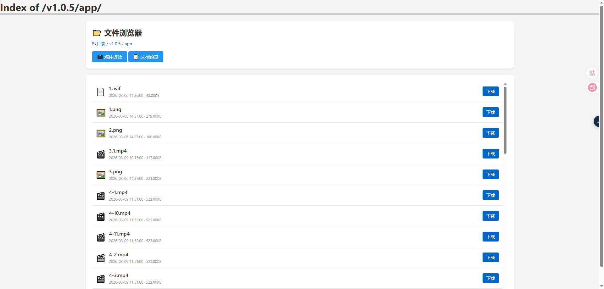
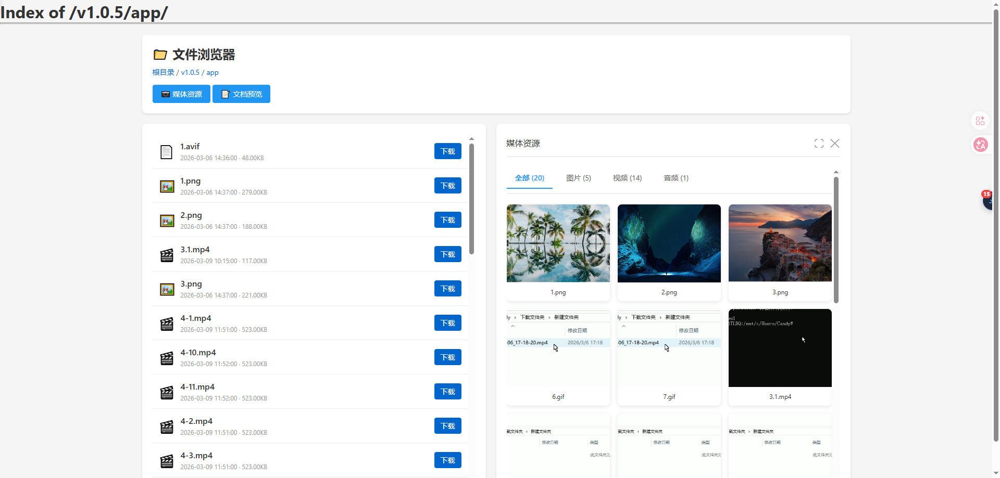
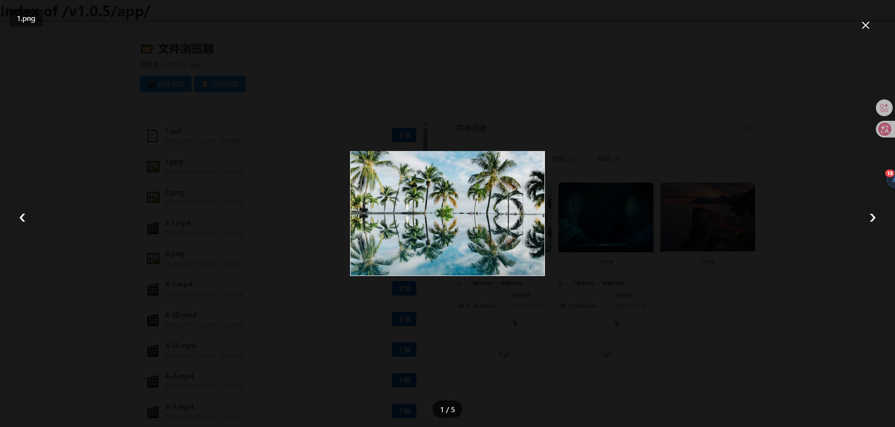
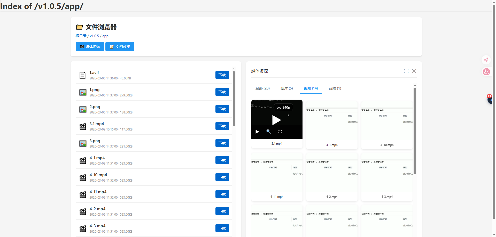
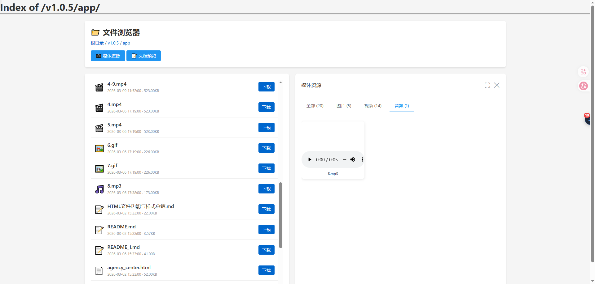
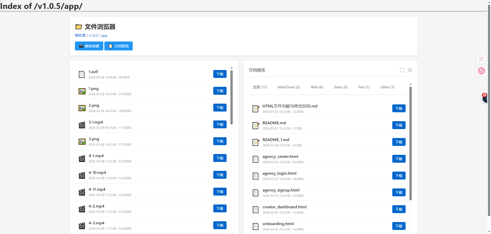
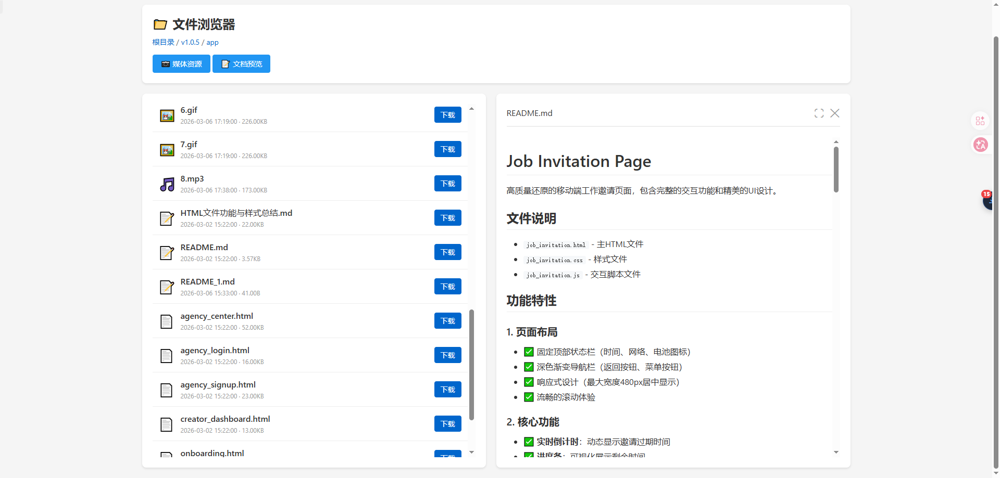
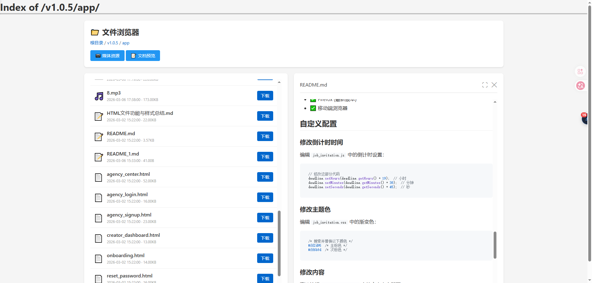

# Nginx Autoindex 美化

一个现代化的 Nginx 目录索引美化方案，单文件部署，开箱即用，提供优雅的文件浏览体验。

## 功能特性

- 📦 **单文件脚本** - 所有样式和脚本集成在一个 HTML 文件中，部署极其简单；单文件+ssi+sub_filter可完全规避页面闪烁问题
- 📁 **文件浏览** - 清晰的文件列表展示，支持文件大小和修改时间显示
- 📷 **媒体资源库** - 图片、视频、音频分类浏览，支持灯箱预览和视频控制；灯箱预览支持键盘左右键切换，支持移动端滑动切换
- 📝 **文档预览** - Markdown 实时渲染预览，支持代码高亮
- 🎨 **响应式设计** - 适配桌面和移动设备
- ⚡ **轻量级** - 纯前端实现，无需后端支持

## 效果展示

<table>
  <tr>
    <td></td>
    <td></td>
  </tr>
  <tr>
    <td></td>
    <td></td>
  </tr>
  <tr>
    <td></td>
    <td></td>
  </tr>
  <tr>
    <td></td>
    <td></td>
  </tr>
</table>

## 使用方法

### 第一步：配置美化脚本路径

在 Nginx 配置文件的 `server` 块中添加以下配置（每个 server 仅需添加一次）：

```nginx
# 判断是否需要美化（排除直接访问 HTML 文件的情况）
set $do_beautify "no";
if ($uri !~* \.(html|htm)$) {
    set $do_beautify "yes";
}

# 定义美化脚本位置
location = /autoindex/index.html {
    internal;  # 仅允许内部访问，防止外部直接访问
    root /path/to/dir;  # 修改为实际路径
}
```

**说明**：将 `index.html` 文件放置到 `/path/to/dir/autoindex/` 目录下。

### 第二步：启用目录索引并加载美化脚本

在需要开启目录浏览的 `location` 块中添加：

```nginx
index off;                    # 禁用默认索引文件
autoindex on;                 # 开启目录索引
autoindex_exact_size off;     # 显示文件大小单位（KB/MB）
autoindex_localtime on;       # 使用本地时间
charset utf-8,gbk;            # 设置字符编码

ssi on;                       # 启用 SSI（服务器端包含）
# 在页面末尾注入美化脚本
sub_filter '</html>' '<!--#if expr="$do_beautify = yes" --><!--#include virtual="/autoindex/index.html" --><!--#endif --></html>';
sub_filter_once on;           # 仅替换一次
```

**说明**：不选择使用add_after_body，而是使用ssi+sub_filter可完全规避页面闪烁问题（使用ssi语法，按需加载美化脚本，而不是在脚本内做判断）

### 配置示例

```nginx
server {
    listen 80;
    server_name files.example.com;

    # 第一步配置
    set $do_beautify "no";
    if ($uri !~* \.(html|htm)$) {
        set $do_beautify "yes";
    }
    location = /autoindex/index.html {
        internal;
        root /path/to/dir;
    }

    # 文件浏览目录
    location / {
        root /var/www/files;

        # 第二步配置
        index off;
        autoindex on;
        autoindex_exact_size off;
        autoindex_localtime on;
        charset utf-8,gbk;

        ssi on;
        sub_filter '</html>' '<!--#if expr="$do_beautify = yes" --><!--#include virtual="/autoindex/index.html" --><!--#endif --></html>';
        sub_filter_once on;
    }
}
```

重启 Nginx 后即可生效：`nginx -s reload`

## 技术栈

- 原生 JavaScript
- Marked.js (Markdown 解析)
- Highlight.js (代码高亮)
